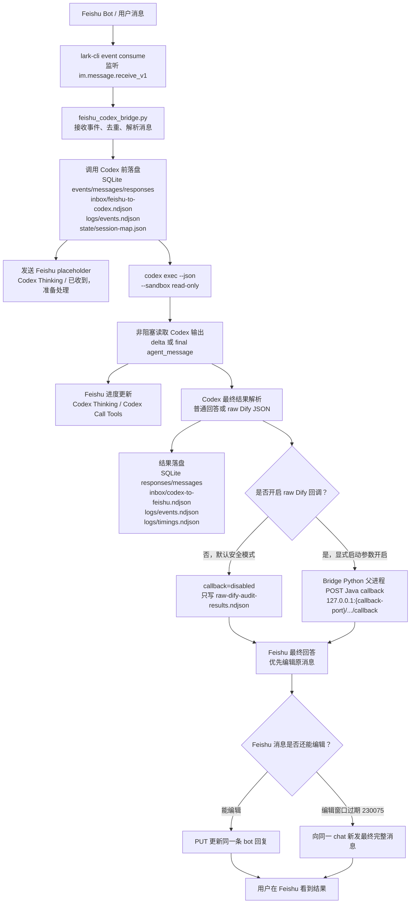

# Feishu/Codex Bridge 可行方案汇报稿

日期：2026-05-22
项目目录：`<bridge-root>`

## 1. 一句话总结

本方案把 Feishu bot、本地 lark-cli、Codex CLI、文件化 Agent Bridge 记忆和业务回调接口串成一条可观测、可恢复、可审计的本地智能体处理链路。

它解决的问题是：

- Feishu 群里可以直接触发本地 Codex 处理任务。
- 任务输入、输出、过程耗时、回调结果都能落盘审计。
- Codex 不直接访问业务系统，由 Bridge 父进程统一负责回调，降低沙箱和网络限制带来的不确定性。
- 长任务期间 Feishu 端有 placeholder 和进度提示，不会表现为“机器人卡死”。
- 回调接口默认关闭，需要时显式开启，避免半成品 SQL 误写业务系统。

## 2. 总体链路图



## 3. 链路逐步说明

### 3.1 Feishu bot 到 Bridge

Feishu bot 收到用户消息后，本机 `lark-cli` 通过事件总线消费：

```bash
lark-cli event consume im.message.receive_v1 --as bot --quiet
```

Bridge 主脚本：

```text
<bridge-root>/bin/feishu_codex_bridge.py
```

负责：

- 监听 Feishu 消息。
- 提取 `event_id`、`message_id`、`chat_id`、`sender_id`、消息正文。
- 根据 `event_id` 做事件去重。
- 先落盘，再调用 Codex。

### 3.2 调用 Codex 前先写文件

调用 Codex 前，Bridge 会先把请求写入本地文件和 SQLite。

这一步很重要，因为它保证即使 Codex 或后续回调失败，也能在本机查到原始请求。

主要写入：

```text
var/bridge.sqlite3
inbox/feishu-to-codex.ndjson
logs/events.ndjson
state/session-map.json
```

含义：

- `bridge.sqlite3`：内部运行状态、去重、消息历史、响应状态。
- `feishu-to-codex.ndjson`：Feishu 发给 Codex 的 request 队列。
- `events.ndjson`：统一审计流水。
- `session-map.json`：当前 Feishu 会话和 Codex session 快照。

### 3.3 Codex 执行

Bridge 调用：

```bash
codex exec --json --ephemeral --skip-git-repo-check --sandbox read-only
```

设计上 Codex 只负责生成结果，不负责直接访问业务系统。

原因：

- Codex 运行在 `--sandbox read-only` 下。
- 它直接访问本机 HTTP 或业务网络时可能被沙箱拦截。
- 业务回调应该由 Bridge Python 父进程负责，这样链路更稳定、责任更清晰。

### 3.4 Codex 输出落入结果文件

Codex 结束后，Bridge 会把结果写回：

```text
var/bridge.sqlite3
inbox/codex-to-feishu.ndjson
logs/events.ndjson
logs/timings.ndjson
```

如果是 raw 表穿透 / Dify audit 任务，还会写：

```text
inbox/raw-dify-audit-results.ndjson
```

这些文件能回答：

- 哪条 Feishu 消息触发了任务。
- Codex 输出了什么。
- 是否解析出 `replacedSql`。
- 是否执行了 callback。
- callback 成功还是失败。
- 总耗时是多少。
- 慢在 placeholder、Codex、Feishu update，还是 callback。

### 3.5 是否回调业务接口

raw Dify audit callback 默认关闭。

默认启动：

```bash
python3 bin/feishu_codex_bridge.py start
```

此时：

```text
raw_dify_audit_callback_enabled = false
```

Bridge 只会把结果写入：

```text
inbox/raw-dify-audit-results.ndjson
```

结果里的 callback 字段会标记：

```json
{
  "status": "disabled",
  "reason": "raw dify audit callback switch is off"
}
```

需要回调时，必须显式启动：

```bash
python3 bin/feishu_codex_bridge.py start --enable-raw-dify-audit-callback
```

或者：

```bash
ENABLE_RAW_DIFY_AUDIT_CALLBACK=true python3 bin/feishu_codex_bridge.py start
```

开启后，Bridge Python 父进程会 POST：

```text
http://127.0.0.1:{callback-port}/api/tg/raw/governance/dify-audit/callback
```

### 3.6 返回 Feishu bot 回答内容

Bridge 给 Feishu 的反馈分三层：

1. placeholder：

```text
Codex Thinking
已收到，准备处理。
```

2. 长任务进度：

```text
Codex Thinking
已等待约 31s，正在理解上下文。
```

```text
Codex Call Tools
已等待约 62s，正在读取工具/上下文。
```

3. 最终结果：

- 优先 `PUT` 更新同一条 bot 回复。
- 如果 Feishu 返回 `230075 The message has exceeded the time that can be edited`，说明消息编辑窗口过期。
- Bridge 会自动向同一 chat 新发完整最终结果，避免结果丢失。

## 4. 机器上的记忆文件说明

整个项目目录：

```text
<bridge-root>
```

### 4.1 `bin/`

用途：放可执行脚本，是整个方案的入口层。

当前核心文件：

```text
bin/feishu_codex_bridge.py
bin/raw_dify_audit_http_bridge.py
```

说明：

- `feishu_codex_bridge.py`：主 bridge。负责 Feishu 消息监听、Codex 调用、Feishu 回复、agent-bridge 文件落盘、健康检查、自恢复、raw Dify 结果解析和可选 callback。
- `raw_dify_audit_http_bridge.py`：本地 HTTP bridge。提供 `/raw-dify-audit/dispatch` 接口，可让测试环境直接把 raw Dify audit 任务投递到本地 Codex，并异步回调。

常用命令：

```bash
python3 bin/feishu_codex_bridge.py start
python3 bin/feishu_codex_bridge.py stop
python3 bin/feishu_codex_bridge.py status
python3 bin/feishu_codex_bridge.py healthcheck --format json
python3 bin/feishu_codex_bridge.py watch --interval 30
```

### 4.2 `inbox/`

用途：方向型消息队列，全部是追加写 NDJSON。

它表示“谁发给谁”的消息记录，是跨 Agent 协议层数据。

当前文件：

```text
inbox/feishu-to-codex.ndjson
inbox/codex-to-feishu.ndjson
inbox/raw-dify-audit-requests.ndjson
inbox/raw-dify-audit-results.ndjson
```

说明：

- `feishu-to-codex.ndjson`：Feishu 用户消息转成 Codex request 后写入。
- `codex-to-feishu.ndjson`：Codex 处理完成后的 result 写入。
- `raw-dify-audit-requests.ndjson`：HTTP bridge 收到的 raw Dify audit dispatch 请求。
- `raw-dify-audit-results.ndjson`：raw Dify audit 的最终解析结果、callback 状态、`replacedSql`、`analysis` 等。

典型用途：

- 排查某条 Feishu 消息有没有被 Bridge 接收到。
- 查看 Codex 对应输出。
- 查看 raw 表穿透任务是否解析出 SQL。
- 查看 callback 是 disabled、success 还是 failed。

### 4.3 `logs/`

用途：审计日志和观测日志，关注“发生了什么”和“耗时在哪里”。

当前文件：

```text
logs/events.ndjson
logs/timings.ndjson
logs/watch.ndjson
logs/raw-dify-audit-http.ndjson
```

说明：

- `events.ndjson`：统一事件审计流水。request/result 都会写入。
- `timings.ndjson`：每条 Feishu 消息的阶段耗时，包括 placeholder、Codex 启动、Codex 输出、Feishu update、callback 落盘等。
- `watch.ndjson`：healthcheck/watch 的检查和自恢复记录。
- `raw-dify-audit-http.ndjson`：独立 HTTP bridge 的访问、接收、完成、失败日志。

典型用途：

- 判断 Feishu bot 是否卡住。
- 判断 Codex 是否长时间无输出。
- 判断是不是 Feishu PUT update 慢。
- 判断 long task 是否触发了 progress。
- 判断自恢复是否发生过。

### 4.4 `state/`

用途：当前会话快照。

当前文件：

```text
state/session-map.json
```

说明：

它记录当前项目下不同 Agent 的 session 状态，例如：

- Feishu 当前 chat/session。
- Feishu sender identity。
- Codex CLI session 标识。
- 最近一次 event/message/reply id。

它不是完整历史，完整历史在 `inbox/`、`logs/` 和 `var/bridge.sqlite3`。

典型用途：

- 快速知道当前 bridge 最近服务的是哪个 Feishu chat。
- 快速定位最近一条 Feishu event 和 reply message。
- 和根目录 agent-bridge 保持统一 `session-map.json` 结构。

### 4.5 `var/`

用途：运行时内部状态，不作为跨 Agent 协议文件。

当前常见文件：

```text
var/bridge.log
var/bridge.pid
var/bridge.sqlite3
var/bridge.sqlite3-wal
var/bridge.sqlite3-shm
var/bridge.snapshot.sqlite3
```

说明：

- `bridge.log`：主 bridge 运行日志，包括启动、收到消息、调用 Codex、Feishu API、callback 等。
- `bridge.pid`：后台 bridge 进程号。
- `bridge.sqlite3`：主运行数据库，存事件去重、消息历史、响应状态。
- `bridge.sqlite3-wal` / `bridge.sqlite3-shm`：SQLite WAL 模式运行文件。
- `bridge.snapshot.sqlite3`：曾经为备份生成的一致性快照。

典型用途：

- 判断后台进程是否还活着。
- 查找某条消息对应的完整运行日志。
- 数据恢复或离线分析。

### 4.6 `docs/`

用途：预留的详细设计文档目录。

当前状态：

- 目前 `docs/` 目录为空。
- 原 `docs/raw_dify_bridge_final_design.md` 的内容已经整合进 `README.md`，所以 README 现在是唯一维护入口。

建议后续：

- 如果方案继续扩展，可以把大型专题设计重新拆到 `docs/`。
- 但要在 README 保留索引，避免文档分散。

### 4.7 `README.md`

用途：当前方案的总入口文档。

它已经整合了：

- Feishu/Codex bridge 基础说明。
- 完整交付记录。
- 第一层观测埋点。
- 第二层稳定性和 watch。
- 第三层 UI/时延体验。
- raw Dify bridge 最终设计。
- 当前运行命令和边界说明。

后续别人接手时，优先读 README。

## 5. raw 表穿透可行方案

### 5.1 背景问题

raw 表穿透替换链路里，Dify 网关可能在长 SQL 场景下出现 503/504 或超时，导致 Java 侧拿不到稳定替换结果。

因此引入本地 Feishu/Lark CLI + Codex/Agent Bridge 做兜底：

- Dify 失败或超时后，由 Java 侧把完整上下文投递给 Feishu bot。
- Bridge 收到 Feishu 消息后调用 Codex。
- Codex 产出结构化 JSON。
- Bridge 解析 JSON，必要时回调 Java。

### 5.2 关键安全原则

SQL 替换不能为了成功而猜测。

如果出现以下情况，必须返回空 `replacedSql`：

- raw 表名和元数据源表不一致。
- raw 表未出现在 SQL 中。
- 字段映射缺失。
- SQL 被截断。
- 模型表或分区字段不确定。
- 只能做局部替换但无法保证完整正确。

这类场景应返回：

```json
{
  "replacedSql": "",
  "analysis": "说明无法安全替换的原因",
  "callback": {
    "auditLogId": 6,
    "replaceAssetId": 512,
    "docId": 751986,
    "rawTableName": "xxx",
    "sceneType": 1,
    "callbackUrl": "http://127.0.0.1:{callback-port}/api/tg/raw/governance/dify-audit/callback",
    "source": "FEISHU_LARK_CLI",
    "tableOwnerName": "owner"
  }
}
```

### 5.3 为什么 callback 由 Bridge 做

旧思路是让 Codex 自己 POST Java callback。

但实际验证发现：

- Codex 运行在 `--sandbox read-only`。
- 它访问 `127.0.0.1:{callback-port}` 可能被沙箱拦截。
- Codex 直接承担业务回调会导致结果不可控。

所以最终设计改为：

```text
Codex 只生成 JSON
Bridge Python 父进程解析 JSON
Bridge Python 父进程 POST Java callback
```

这样回调是否开启、回调结果、失败原因都能在本地文件里清楚记录。

## 6. 当前运行状态

当前已按默认安全模式重启：

```text
bridge pid: 48610
event bus pid: 48626
active consumers: 1
dropped: 0
healthcheck: healthy
```

当前启动参数没有：

```text
--enable-raw-dify-audit-callback
```

因此当前状态是：

```text
Feishu/Codex bridge 正常常驻
raw Dify audit callback 关闭
```

## 7. 述职可讲的价值

### 7.1 工程价值

- 把 Feishu bot 从简单聊天入口升级为可触发本地 Agent 工作流的入口。
- 把 Agent 处理过程文件化、可审计、可回放。
- 通过 SQLite + NDJSON 双层存储，兼顾运行态和协议态。
- 通过 `healthcheck/watch` 提供常驻稳定性基础。
- 通过 timing 记录，把“慢”拆解成可定位的阶段。

### 7.2 业务价值

- 为 Dify 503/504、长 SQL 超时提供兜底处理链路。
- raw 表穿透替换结果可由 Codex 辅助产出，但最终仍由 Java EXPLAIN 和业务逻辑把关。
- 不确定时返回空 SQL，避免误替换造成数据风险。
- callback 默认关闭，降低误写业务系统的风险。

### 7.3 可维护性价值

- 所有文件统一在 `agent-bridge/feishu-codex`。
- `bin/`、`inbox/`、`logs/`、`state/`、`var/` 职责清晰。
- README 是唯一维护入口。
- 根目录 Claude/Codex bridge 和 Feishu/Codex bridge 数据隔离，不互相污染。

## 8. 后续规划

建议下一步按优先级推进：

1. 将 `watch --interval 30` 接入 macOS launchd user agent，实现登录后自动常驻和自恢复。
2. Java 侧投递 raw Dify audit 任务时，确保 prompt 不被 Feishu 截断；超大上下文建议改为任务 ID + 内部拉取接口。
3. 对 `raw-dify-audit-results.ndjson` 做一个简单查询脚本，方便按 `auditLogId` 查结果。
4. 在 callback 开启前，用一条真实失败数据确认 `callback.status=success` 且 Java 返回符合预期。
5. 继续采样 `timings.ndjson`，判断瓶颈主要来自 Codex 启动、模型生成、无 delta 输出，还是 Feishu update 限制。

## 9. 述职时可以这样收尾

这套方案的核心不是让大模型直接接管业务系统，而是把大模型放在一个可观测、可审计、可回滚的 Bridge 中。

Feishu 负责触发和展示，Codex 负责生成候选结果，Bridge 负责落盘、兜底和可选回调，Java 负责最终业务校验和状态更新。

这样既能利用智能体处理长上下文和复杂 SQL 的能力，又不会绕过业务系统原有的校验和治理边界。
