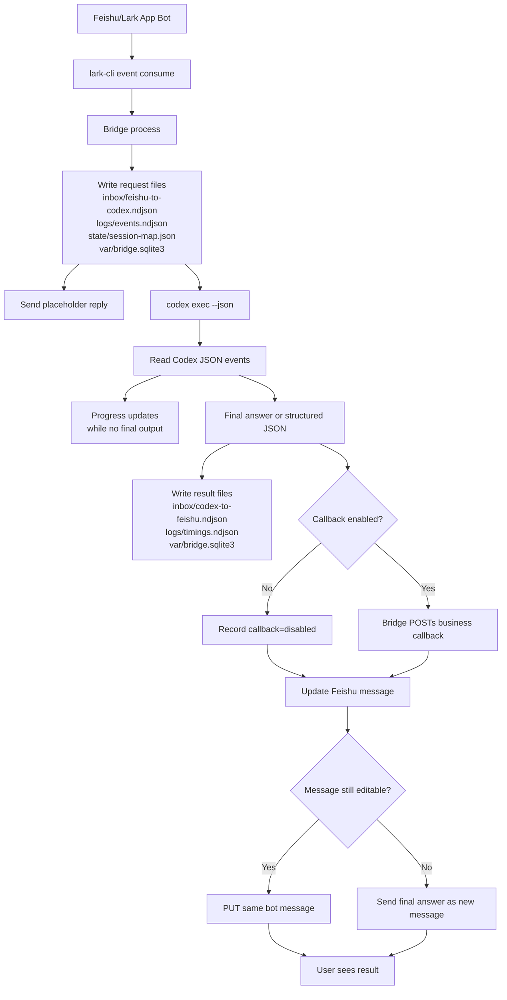

# Feishu App Codex Bridge

> A local-first, file-backed Feishu/Lark to Codex bridge for auditable enterprise agent workflows, with long-running progress updates, local memory, health checks, fallback messaging, and optional business callbacks.

## What This Project Is

`feishu-app-codex-bridge` connects an online Feishu/Lark app bot to a local Codex CLI runtime.

It is designed for enterprise local-private workflows where a cloud chat app needs to trigger local agent work safely:

```text
Feishu/Lark bot
  -> local lark-cli event consumer
  -> local bridge process
  -> local Codex CLI
  -> file-backed memory and audit logs
  -> optional business callback
  -> Feishu/Lark bot reply
```

It is not just a chat relay. The bridge records every request, result, timing, and state transition into local files so a team can audit, replay, debug, and explain what happened.

## Positioning

There are already projects that let users control Codex or other coding agents from chat apps. This project focuses on a narrower enterprise pattern:

- Feishu/Lark app as the online entrypoint.
- Local `lark-cli` as the trusted event and OpenAPI adapter.
- Local Codex CLI as the agent runtime.
- File-backed `inbox/`, `logs/`, `state/`, and SQLite memory.
- Progress updates for long-running tasks.
- Fallback behavior when Feishu/Lark message editing expires.
- `healthcheck` and `watch` for local persistence.
- Optional business callback that is disabled by default.

The most important boundary is:

```text
Codex generates structured output.
The bridge process owns persistence, Feishu replies, and optional callbacks.
```

That keeps business side effects out of the model sandbox and inside an auditable process.

## Architecture



More detail:

- [Architecture](docs/architecture.md)
- [File Protocol](docs/file-protocol.md)
- [Callbacks](docs/callbacks.md)
- [Operations](docs/operations.md)

## Directory Layout

```text
feishu-app-codex-bridge/
├── bin/
│   └── feishu_app_codex_bridge.py
├── docs/
│   ├── architecture.md
│   ├── callbacks.md
│   ├── file-protocol.md
│   └── operations.md
├── examples/
│   └── raw-dify-audit/
│       ├── prompt.example.md
│       └── task.example.json
├── inbox/
│   ├── feishu-to-codex.ndjson
│   ├── codex-to-feishu.ndjson
│   └── callback-results.ndjson
├── logs/
│   ├── events.ndjson
│   ├── timings.ndjson
│   └── watch.ndjson
├── state/
│   └── session-map.json
└── var/
    ├── bridge.log
    ├── bridge.pid
    └── bridge.sqlite3
```

Runtime files are ignored by Git. Empty directory placeholders are kept with `.gitkeep`.

## Requirements

- macOS or Linux.
- Python 3.9+.
- Feishu/Lark `lark-cli` authenticated as a bot.
- Codex CLI installed and authenticated.
- Feishu/Lark app has message receive events enabled.
- Bot has the required message read/reply permissions.

Check local tools:

```bash
lark-cli auth status
lark-cli event status
codex --version
```

## Quick Start

Initialize local runtime files:

```bash
python3 bin/feishu_app_codex_bridge.py init
```

Run in foreground:

```bash
python3 bin/feishu_app_codex_bridge.py run
```

Start in background:

```bash
python3 bin/feishu_app_codex_bridge.py start
```

Check status:

```bash
python3 bin/feishu_app_codex_bridge.py status
python3 bin/feishu_app_codex_bridge.py healthcheck --format json
```

Stop:

```bash
python3 bin/feishu_app_codex_bridge.py stop
```

Run a self-recovery watch loop:

```bash
python3 bin/feishu_app_codex_bridge.py watch --interval 30
```

## Callback Safety

Callbacks are disabled by default.

Default behavior:

```text
Feishu message -> Codex -> local files -> Feishu answer
```

Enable callbacks only after validating your callback endpoint:

```bash
python3 bin/feishu_app_codex_bridge.py start --enable-callback
```

or:

```bash
FEISHU_APP_CODEX_ENABLE_CALLBACK=true python3 bin/feishu_app_codex_bridge.py start
```

When callback is disabled, the bridge still writes a callback record:

```json
{"status":"disabled","reason":"callback switch is off"}
```

## Business Workflow Example

The `examples/raw-dify-audit/` directory shows a generic sanitized workflow:

```text
Dify timeout or gateway failure
  -> business system sends task to Feishu/Lark
  -> bridge asks Codex to produce structured JSON
  -> bridge stores the result
  -> optional callback submits the result to business system
```

This is useful for long-running enterprise tasks where the model should produce a candidate result but the business system must keep final validation authority.

## Security Model

- Do not commit runtime data from `inbox/`, `logs/`, `state/`, or `var/`.
- Do not put app secrets in prompts or examples.
- Keep callbacks disabled until the endpoint is tested.
- Treat Codex output as untrusted candidate output.
- Let business systems validate results before state changes.
- Prefer structured JSON outputs for callback workflows.

## License

MIT

