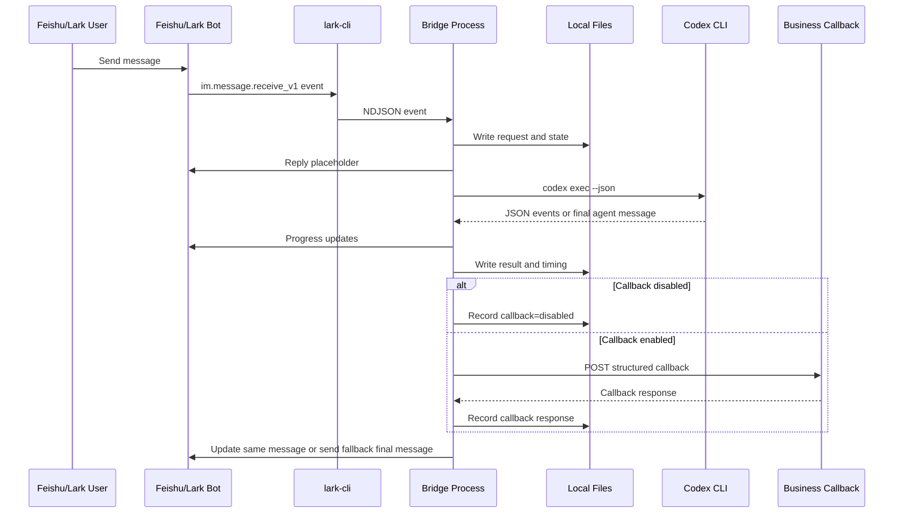

# Architecture

## Goal

This project provides a local-private bridge between an online Feishu/Lark app bot and a local Codex CLI runtime.

The goal is not to let a model directly control production systems. The goal is to place a local bridge between the chat app, the model, local audit files, and optional business callbacks.

## Core Flow



## Design Decisions

### Use lark-cli as the Feishu/Lark adapter

The bridge delegates Feishu/Lark authentication, event consumption, and OpenAPI calls to `lark-cli`.

Benefits:

- No app secret handling inside this project.
- Reuses the official CLI behavior.
- Works well for local-private agent workflows.

### Store before running Codex

The bridge writes the incoming request before it invokes Codex.

That means a crash, timeout, or callback failure still leaves an audit trail.

### Keep Codex side-effect-light

Codex is asked to produce text or structured JSON. The bridge owns:

- file persistence
- Feishu/Lark message updates
- callback policy
- callback execution
- timing logs

This makes the workflow easier to audit and safer to run in enterprise settings.

### Prefer full-message replacement for Feishu/Lark streaming

Feishu/Lark message editing is replacement-based. The bridge maintains an accumulated buffer locally and sends the full buffer on update.

If the message is no longer editable, the bridge sends the final output as a new message in the same chat.

## Runtime Modes

### Foreground

```bash
python3 bin/feishu_app_codex_bridge.py run
```

Useful for development and debugging.

### Background

```bash
python3 bin/feishu_app_codex_bridge.py start
```

Writes a pid file to `var/bridge.pid` and logs to `var/bridge.log`.

### Watch

```bash
python3 bin/feishu_app_codex_bridge.py watch --interval 30
```

Checks the pid file and `lark-cli event status`. If unhealthy, it can restart the bridge.

